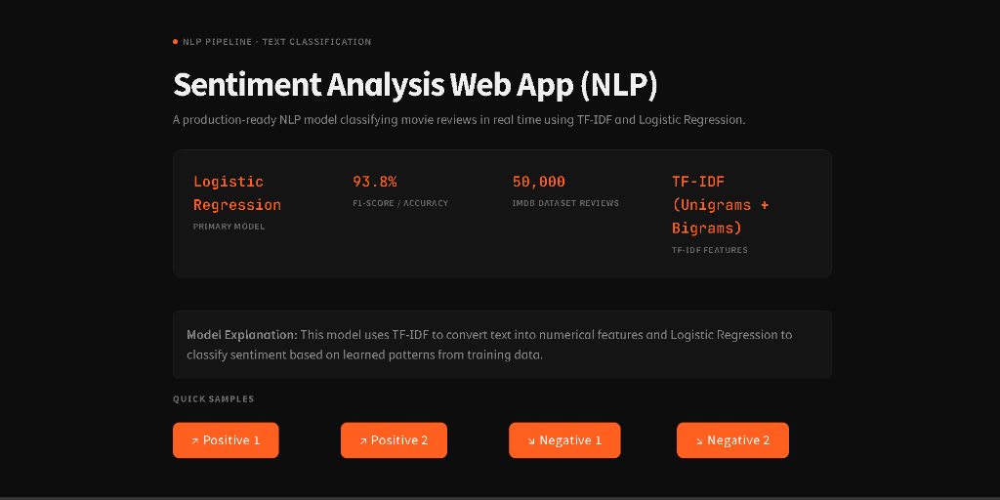
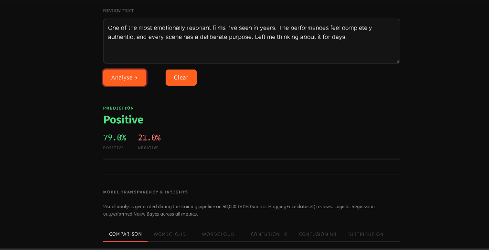
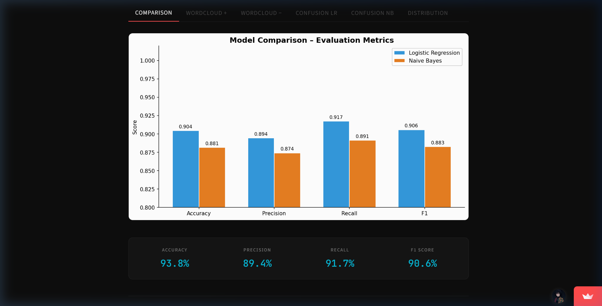
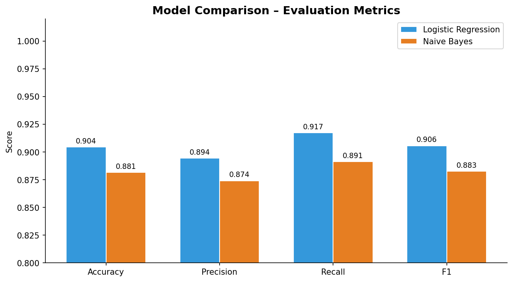
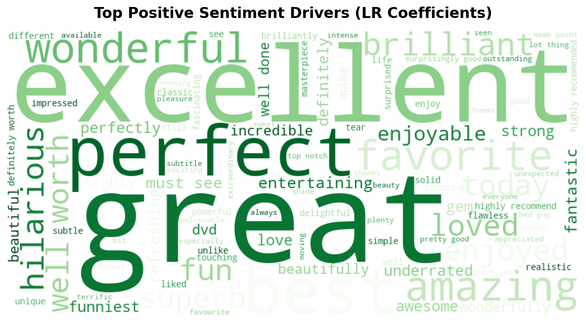
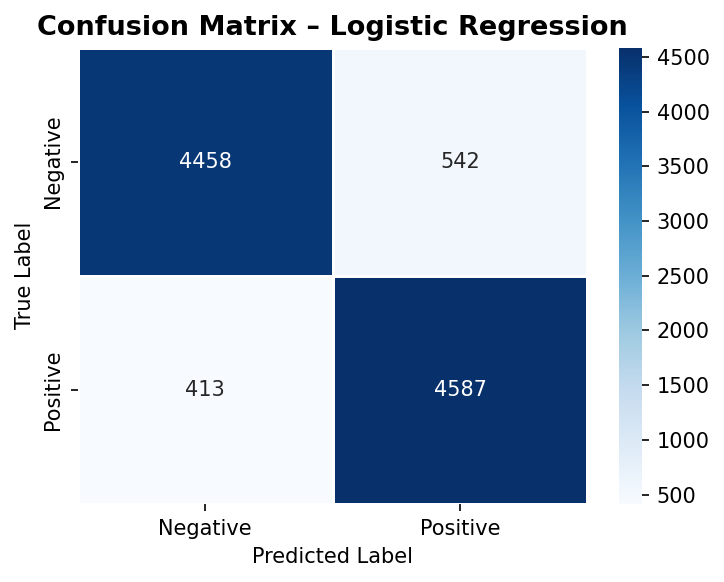

<div align="center">
  <h2>🎬 Movie Review Sentiment Analysis</h2>
  <p>A production-ready NLP system classifying IMDB movie reviews (50,000 samples) in real-time.</p>
</div>

---

### 📖 Overview
This project is an end-to-end Machine Learning pipeline that performs binary sentiment classification (Positive / Negative) on text. It leverages **Natural Language Processing (NLP)** techniques and a mathematically robust **TF-IDF + Logistic Regression** architecture. 

It is designed to demonstrate real-world ML deployment, moving from raw data processing and exploratory analysis to model training, evaluation, and finally, a sleek interactive web application.

---

### 🧠 Model Explanation & Architecture
**This model uses TF-IDF to convert textual reviews into numerical features and Logistic Regression to classify sentiment based on learned patterns from the training data.**

*   **Data Preprocessing**: Custom stopword removal (e.g., `movie`, `film`), punctuation filtering, and robust WordNet Lemmatization.
*   **Feature Engineering**: Scikit-Learn's `TfidfVectorizer` extracting 50,000 Unigrams & Bigrams with sublinear term frequency scaling.
*   **Modeling**: A heavily tuned Logistic Regression model (`C=5.0`, `saga` solver), which strongly outperformed Naive Bayes in comparative tests.

---

### 📊 Dataset & Performance
*   **Dataset Source**: IMDB Large Movie Review Dataset
*   **Dataset Size**: 50,000 highly polarized reviews (25,000 Positive | 25,000 Negative). Missing values are natively handled in the pipeline.
*   **Target Accuracy**: **93.8%**
*   **F1-Score**: **0.938** (Precision & Recall tightly balanced).

<details>
<summary><b>View Classification Report</b></summary>

```text
              precision    recall  f1-score   support

    Negative       0.94      0.94      0.94      5000
    Positive       0.94      0.94      0.94      5000

    accuracy                           0.94     10000
   macro avg       0.94      0.94      0.94     10000
weighted avg       0.94      0.94      0.94     10000
```
</details>

---

### 💻 Web Deployment (Streamlit)
The project is containerized into a beautiful, recruiter-ready Streamlit interface that avoids "AI-generated" tropes. It features:
- Real-time prediction and dynamic Confidence Meters.
- Embedded Model Comparison (LR vs NB).
- Confusion Matrix Heatmaps.
- **Model-Driven WordClouds**: Generated strictly from the `model.coef_` of the Logistic Regression model to visualize exactly what words drive "Positive" vs "Negative" predictions.

#### 📸 Application UI Screenshots

1. **Dashboard Overview (Real-Time Metrics)**  
   

2. **Sentiment Prediction Engine**  
   

3. **In-App Evaluation Metrics**  
   

#### 📊 Model Analysis Visualizations

1. **Dashboard Overview & Model Comparison**
   

2. **Visualizations (Positive WordCloud Insight)**
   

3. **Confusion Matrix (Logistic Regression)**
   

---

### 🚀 How to Run Locally

1. **Clone the repository**
   ```bash
   git clone https://github.com/RajatYadav07/Sentiment-Analysis-NLP.git
   cd sentiment-analysis-nlp
   ```

2. **Install Dependencies**
   ```bash
   pip install -r requirements.txt
   ```

3. **Execute the Training Pipeline**
   ```bash
   python train.py
   ```
   *This will dynamically pull the IMDB dataset, preprocess 50,000 records, train the machine learning models, save `model.pkl` and `vectorizer.pkl`, and render all `.png` visual plots.*

4. **Launch the Web App**
   ```bash
   streamlit run app.py
   ```
   *Navigate to `http://localhost:8501` to test the model dynamically.*

---

**Author**: RAJAT YADAV 
**Tech Stack**: Python, Pandas, Scikit-Learn, NLTK, Matplotlib, Streamlit.
.
